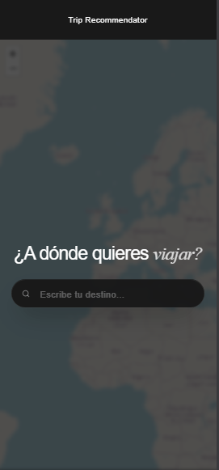
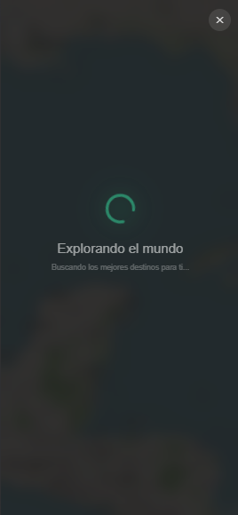
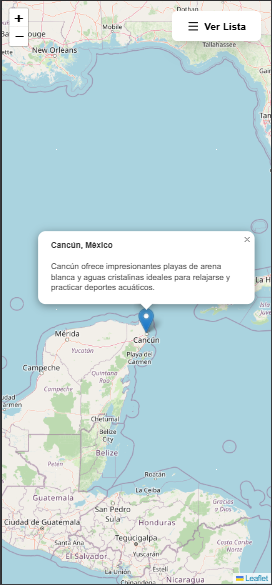
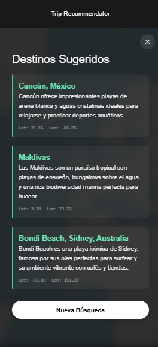

# Trip Recommendator 🌍✈️


**Trip Recommendator** es una aplicación web moderna diseñada con un enfoque **Mobile-First** que utiliza **Inteligencia Artificial** para sugerir destinos de viaje basándose en las preferencias del usuario.

El usuario puede describir su viaje ideal en lenguaje natural (ej: "Quiero un lugar con playas tranquilas, buena comida y clima tropical"), y la aplicación, impulsada por la **API de Google Gemini**, procesará la solicitud para mostrar destinos recomendados en un **mapa interactivo**.

---

## 🚀 Características Principales

- **Búsqueda con IA (Free-Text Input):** Procesamiento de lenguaje natural utilizando Google GenAI para interpretar descripciones complejas de viajes.  
- **Mapa Interactivo:** Visualización de destinos mediante Leaflet y marcadores personalizados.  
- **Diseño Mobile-First:** Interfaz responsiva y adaptativa, optimizada para dispositivos móviles y de escritorio.  
- **UI Moderna (Luxury Tech):** Estética elegante con modo oscuro, efectos de vidrio (glassmorphism) y animaciones fluidas.  
- **Arquitectura:** Frontend (Vite + React) y Backend (Express).

---

## 📸 Capturas de Pantalla

<div align="center">
  
  
  <br/>
  <br/>
  
  
</div>

---


---


## 🛠️ Stack Tecnológico

### Frontend
- **Framework:** React 19 + Vite  
- **Lenguaje:** TypeScript  
- **Estilos:** TailwindCSS + Autoprefixer  
- **Mapas:** Leaflet + React-Leaflet  
- **Iconos:** Lucide React  
- **IA (Cliente):** @google/genai (Integración directa o vía backend)  

### Backend
- **Runtime:** Node.js  
- **Framework:** Express.js  
- **Lenguaje:** TypeScript  
- **IA:** @google/genai (Google Gemini API)  
- **Utilidades:** CORS, ts-node  

### DevOps
- **Contenedorización:** Docker + Docker Compose  
- **Linting:** ESLint  

---

## 📋 Requisitos Previos

Asegúrate de tener instalado lo siguiente en tu sistema:

- Node.js (v18 o superior recomendado)  
- Docker Desktop (Obligatorio para la entrega)  
- Una API Key de Google Gemini (Google AI Studio)

### Archivos de Configuración

1.  Crea un archivo `.env` en la raíz del backend (`backend/.env`) **(Solo para ejecución manual sin Docker)**:
    ```bash
    PORT=9000
    GEMINI_API_KEY=tu_api_key_aqui
    ```
2.  Para Docker, asegúrate de que las variables de entorno necesarias estén configuradas en `docker-compose.yml` o en un archivo `.env` en la raíz del proyecto si decides externalizarlas.

---


## 🔧 Instalación y Ejecución (Entorno Local)


###  🐳 Ejecución con Docker
Para cumplir con los requisitos de entrega, el proyecto está completamente dockerizado.

Asegúrate de estar en la raíz del proyecto (donde está el docker-compose.yml).

Construye y levanta los contenedores:
```bash
docker-compose up --build
```

Esto iniciará tanto el frontend como el backend.

- Frontend: Accesible en http://localhost:3000
- Backend: Accesible en http://localhost:9000

### 📂 Estructura del Proyecto
```bash
TripRecommendator/
├── backend/            # Servidor Express y lógica de IA
│   ├── src/
│   │   ├── server.ts   # Punto de entrada
│   │   └── ...
│   ├── Dockerfile
│   └── package.json
│
├── frontend/           # Cliente React + Vite
│   ├── src/
│   │   ├── components/ # Componentes (SearchBar, Map, etc.)
│   │   ├── App.tsx
│   │   └── main.tsx
│   ├── Dockerfile
│   └── package.json
│
├── docker-compose.yml  # Orquestación de servicios
└── README.md           # Documentación del proyecto
```

### ✒️ Autor

Desarrollado por fdiaz-gu.
